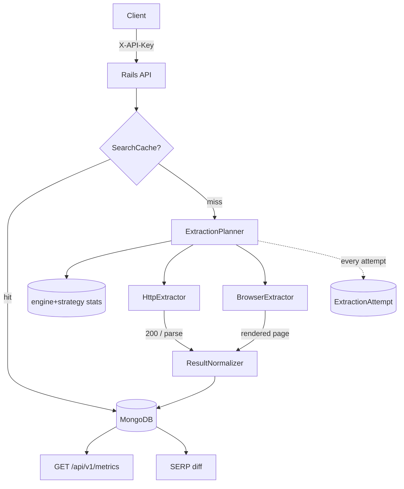

# SearchProbe

**Adaptive search extraction infrastructure built with Ruby on Rails.**

SearchProbe is an API that turns a search query into normalized search-engine
results. Under the hood it hides a genuinely interesting problem: search
engines do not want to be scraped. The API makes the extraction strategy
(`HTTP` vs `headless browser`), retry/backoff behaviour, failure taxonomy,
caching, and per-engine history invisible to the client.

```
query ──► SearchProbe ──► { normalized results, strategy, latency }
```

Everything is runnable against a **local, deterministic search-engine
simulator**, so the retry/fallback machinery is fully demonstrable without
hammering (or being blocked by) a real engine.

---

## 1. What is SearchProbe?

A small but production-shaped **search-data extraction API**. It accepts:

```http
GET /api/v1/search?q=best+rust+web+framework&engine=google
X-API-Key: dev-key
```

and returns normalized, deduplicated, typed results:

```json
{
  "query": "best rust web framework",
  "engine": "google",
  "results": [
    {
      "position": 1,
      "title": "Rust Web Framework vs. the competition",
      "url": "https://www.example.com/rust-web-framework-vs-the-competition",
      "snippet": "We compare the most important rust web framework concepts...",
      "result_type": "organic"
    }
  ],
  "metadata": { "cached": false, "latency_ms": 120, "strategy": "http", "attempts": 1 }
}
```

Extraction complexity is hidden behind a stable, normalized contract: the
client only cares about **query → normalized results**.

SearchProbe is **simulator-first**: it runs against a deterministic local
search-engine simulator so the entire failure matrix is reproducible and
testable offline. Because extraction goes through a small **provider
registry**, real engines can be switched on behind the exact same interface —
the API, planner, and models never change. Two live **Bing** providers ship
today (opt-in via `LIVE_ENGINES`), and adding any other engine is one new
provider class.

## 2. Why I built it

Search extraction looks deceptively simple until you actually try it:

- engines return different HTML for the *same* logical result,
- they rate-limit and block plain HTTP clients,
- some pages need a real browser to render,
- "just scrape it with curl" quietly breaks at 3 a.m.

I wanted a portfolio piece that shows I can reason about *failure* — adaptive
strategies, retries, fallbacks, caching, rate limiting, and observability —
not just CRUD. SearchProbe packages that reasoning into a clean Rails API
with MongoDB persistence, background jobs, metrics, SERP diffing, tests, and
Docker, all driven by a deterministic local simulator so the story is
reproducible in under two minutes.

## 3. Architecture



Layers:

| Layer | Pieces |
| --- | --- |
| Transport | Rails 8 (JSON API), Puma, Rack |
| Domain | `SearchService` → `ExtractionPlanner` → `Extractor` strategies |
| Extraction | `HttpExtractor`, `BrowserExtractor` (Playwright worker), `SerpParser`, `ResultNormalizer` |
| Persistence | MongoDB via Mongoid (`Search`, `SearchResult`, `ExtractionAttempt`, `ApiKey`, `RateLimitEntry`) |
| Ops | memory cache (`SearchCache`), `RateLimiter`, `StructuredLog`, ActiveJob (`SearchJob`), `/health`, `/api/v1/metrics` |
| Tooling | local SERP **simulator**, dashboard, RSpec, RuboCop, Docker Compose |

## 4. Features

- **Normalized REST API** — `GET /api/v1/search` (sync) and `POST/GET /api/v1/searches` (async, ActiveJob)
- **Provider registry** — each engine resolves to a `Provider` (simulator by default; **live Bing RSS + Bing HTML** adapters when enabled via `LIVE_ENGINES`). Real providers plug in without touching the API or planner
- **Two extraction strategies** behind one interface — cheap HTTP first, headless-browser fallback
- **Adaptive planner** — picks strategies from historical success rate and latency; retries transient failures with backoff; escalates blocks/CAPTCHAs/parse walls to the browser; never bypasses a real CAPTCHA
- **Deterministic search-engine simulator** — injectable `403 / 429 / 500 / timeout / captcha / malformed` modes
- **Extraction telemetry** — every attempt persisted + logged (`ExtractionAttempt`, JSON events with `request_id`)
- **Caching** — identical `query+engine` for TTL 5 min, `force_refresh=true` bypass
- **API keys & rate limiting** — BCrypt-hashed keys, per-key 100 req/min with `Retry-After`
- **Metrics endpoint + dashboard** — totals, success/cache-hit rates, per-strategy stats, failure breakdown, recent attempts
- **SERP diffing** — compare the latest result set to the previous one for the same `query+engine`
- **Tested** — 157 RSpec examples, RuboCop clean, Dockerized CI

## 5. Request flow (synchronous)

```
1. Client → GET /api/v1/search (X-API-Key)
2. Api::V1::BaseController → authenticate key → rate-limit check (429 if exceeded)
3. SearchService validates q (required, ≤ 500 chars) and engine (supported → else 404)
4. Cache lookup (search:{engine}:{normalized query}). Hit → persist lightweight
   Search(cache_hit:true) + respond cached:true
5. Miss → Search(status:running) created → ExtractionPlanner runs
6. Planner executes attempts, recording each in ExtractionAttempt + JSON logs
7. Success → normalized results persisted as SearchResults, cache written,
   respond with metadata (strategy, latency_ms, attempts)
8. All strategies failed → structured error (500) with failure taxonomy
```

The async flow is identical except the planner runs inside `SearchJob`, and the
client polls `GET /api/v1/searches/:id`.

## 6. Adaptive extraction strategy

Every extractor implements:

```ruby
extract(query:, engine:, context:) → ExtractionResult
# success | failure with error_type ∈ timeout/rate_limited/blocked/captcha/
#                                  parse_error/network_error/unknown
```

Where the request goes is a **provider** decision (`EngineRegistry` →
`Providers::SimulatorProvider | BingHtmlProvider | BingRssProvider`), not an
extractor concern. Extractors stay engine-agnostic: they ask the provider for
the endpoint, fetch it, and normalize whatever the provider parsed. Switching
Bing to live extraction is a config change, not a code change:

The planner keeps historical statistics per `engine + strategy`:

```
Google / HTTP     success_rate: 0.94   avg_latency_ms: 380   score = 0.00247
Google / Browser  success_rate: 0.99   avg_latency_ms: 2180  score = 0.00045
```

- **Strategy score** = `success_rate / average_latency_ms`. Cheap HTTP normally
  wins on score; if its historical reliability collapses, the browser leads.
- **Decision table**:

| Situation | Action |
| --- | --- |
| HTTP succeeds | return immediately |
| timeout / network / HTTP 5xx | retry same strategy with backoff (100 → 200 → 400 ms) |
| HTTP 403 / 429 / CAPTCHA / parse wall | escalate to **browser** (a real renderer may pass) |
| browser failure | structured error — nothing left to try, no CAPTCHA bypass |
| extractor raises unexpectedly | recorded as a structured `unknown` failure |

A hard **`MAX_ATTEMPTS`** (default 3) caps total work per search.

### Live providers

Live extraction is **off by default**; enable it with the environment variable:

```bash
LIVE_ENGINES=bing docker compose up -d        # Bing via the HTML scrape adapter
LIVE_ENGINES=bing_rss docker compose up -d    # Bing via the stable RSS feed
```

- `bing` → `BingHtmlProvider`: parses `li.b_algo` blocks and **unwraps Bing's
  `bing.com/ck/a` redirect wrapper** back to the real destination URL.
- `bing_rss` → `BingRssProvider`: parses the public RSS feed (`format=rss`) —
  the most stable live path.
- Engines *not* listed stay on the simulator, so tests/CI and the default demo
  never depend on the network.
- Live engines honor the same failure taxonomy: a real block/rate-limit/challenge
  surfaces as a structured error (or escalates to the browser) — nothing is
  bypassed.
- Both adapters are verified against committed real Bing fixtures, and the
  demo-only `simulate*` params are **never** forwarded to a live engine.
- Google/DuckDuckGo remain simulator-only for now (heavily bot-walled and
  ToS-fragile); adding one later is a new provider class plus a registry line.

## 7. Data model

| Collection | Purpose |
| --- | --- |
| `searches` | one document per API search: query, engine, status (`queued/running/completed/failed`), `cache_hit`, `latency_ms`, `strategy`, `error_type`, `created_at`. Indexed by query, engine, created_at, and `{query, engine}`. |
| `search_results` | the normalized result rows for a search (position, title, url, snippet, result_type). |
| `extraction_attempts` | telemetry per strategy attempt: strategy, status, `http_status`, `latency_ms`, error taxonomy. Indexed by time, engine+strategy, error_type. |
| `api_keys` | name + **BCrypt digest only** (plaintext is shown once at seed). |
| `rate_limit_entries` | fixed-window counters with a Mongo TTL index for auto-expiry. |

No credentials, cookies, proxies, or headers are ever persisted.

## 8. API examples

```bash
KEY="X-API-Key: dev-key"
BASE="http://localhost:3000"

# Synchronous search
curl -H "$KEY" "$BASE/api/v1/search?q=rust+web+framework&engine=google"

# Force a fresh extraction (bypass cache)
curl -H "$KEY" "$BASE/api/v1/search?q=rust&engine=google&force_refresh=true"

# Async search
curl -X POST -H "$KEY" -H "Content-Type: application/json" \
     -d '{"query":"rust web framework","engine":"google"}' "$BASE/api/v1/searches"
curl -H "$KEY" "$BASE/api/v1/searches/<id>"

# SERP diff against the previous result for the same query+engine
curl -H "$KEY" "$BASE/api/v1/searches/<id>/diff"

# Operational metrics + recent attempts
curl -H "$KEY" "$BASE/api/v1/metrics"
curl -H "$KEY" "$BASE/api/v1/attempts?limit=15"

# Health
curl "$BASE/health"

# Dashboard
open "$BASE/dashboard"
```

Status codes: `200` success · `202` accepted (async) · `400` invalid request ·
`401` bad/missing key · `404` unsupported engine / unknown resource · `429`
rate limited · `500` unexpected / structured extraction failure.

## 9. Failure handling

The simulator can stand in for any engine condition, so every failure path is
exercised without touching the internet:

```bash
# Simulate a rate limit: HTTP 429 → planner escalates → browser succeeds
curl -H "$KEY" "$BASE/api/v1/search?q=rust&simulate=429"

# Simulate a block: HTTP 403 → browser succeeds
curl -H "$KEY" "$BASE/api/v1/search?q=rust&simulate=403"

# Simulate a CAPTCHA: HTTP + browser both fail → structured error
curl -H "$KEY" "$BASE/api/v1/search?q=rust&simulate=captcha"

# Simulate a server meltdown: retried 3x, structured error
curl -H "$KEY" "$BASE/api/v1/search?q=rust&simulate=500"
```

`simulate` is a **demo-only hook** that only alters the local simulator; real
engines would never see it. Failures are recorded in `extraction_attempts`
with a machine-readable `error_type` and returned as:

```json
{ "error": { "code": "extraction_failed", "type": "captcha",
             "message": "browser was presented a CAPTCHA challenge", "http_status": 200 } }
```

## 10. Caching

- Key: `search:{engine}:{normalized query}` (query is stripped + downcased).
- TTL: 5 minutes (`CACHE_TTL`).
- On a hit the API still records a lightweight `Search`/`SearchResult` row
  (`cached: true`, `strategy: "cache"`) so metrics, dashboard and SERP diffing
  stay coherent, and the response reports `"cached": true`.
- `force_refresh=true` bypasses the cache. Simulated/demo requests are never
  cached.

## 11. Observability

Every extraction attempt emits one JSON object per line:

```json
{"ts":"2026-09-03T06:34:50Z","event":"extraction_attempt",
 "request_id":"...","search_id":"...","query":"rust web framework",
 "engine":"google","strategy":"http","latency_ms":27,
 "success":true,"http_status":200}
```

Plus lifecycle events (`search.completed`, `search.failed`, `search.cache_hit`,
`rate_limit.exceeded`) and `GET /health` (`{status, database}`). Logs go to
stdout (`LOG_JSON=true`) so `docker compose logs -f backend` is greppable.

## 12. SERP diffing

SearchProbe stores history, which enables change detection over time:

```bash
# Run once normally, then re-run with the simulator's ordering flipped:
curl -H "$KEY" "$BASE/api/v1/search?q=rust&engine=google"
curl -H "$KEY" "$BASE/api/v1/search?q=rust&engine=google&simulate_order=reversed"
curl -H "$KEY" "$BASE/api/v1/searches/<second-id>/diff"
```

```json
{
  "search_id": "…",
  "compared_to": "…",
  "added": [],
  "removed": [],
  "position_changes": [
    { "title": "Rust web framework", "url": "https://…", "from": 8, "to": 1 }
  ]
}
```

Results are keyed by canonical URL, so the same page moving from rank 8 → 1 is
a `position_change`, not an add + remove.

## 13. Local development

Prereqs: **Docker** (with Compose). Ruby/MongoDB are only ever needed inside
containers.

```bash
docker compose up -d        # mongo + Rails backend + Playwright worker
docker compose ps           # all three healthy
```

The dev entrypoint provisions indexes and seeds API keys on boot. The seeded
development key is **`dev-key`** (also printed by `bin/rails db:seed`):

```bash
curl -H "X-API-Key: dev-key" \
  "http://localhost:3000/api/v1/search?q=rust+web+framework&engine=google"
```

Play with the dashboard: <http://localhost:3000/dashboard>.

To open a Rails console / run a one-off command:

```bash
docker compose run --rm backend bin/rails console
docker compose run --rm backend bin/rails routes
```

## 14. Running tests

```bash
./script/test                      # full suite (spins a throwaway backend on the compose network)
./script/test spec/requests/search_api_spec.rb
./script/test spec/services/extraction_planner_spec.rb:45

docker compose run --rm backend bundle exec rubocop   # lint
```

The test database is isolated (`searchprobe_test`) and truncated between
examples. All outbound HTTP (simulator + worker) is WebMock-stubbed; the live
Bing providers are covered by committed real-response fixtures, so the suite
never touches the network either.

## 15. Docker

| Service | Image | Purpose | Port |
| --- | --- | --- | --- |
| `mongo` | `mongo:7` | persistence | 27017 |
| `backend` | `searchprobe-backend` (`Dockerfile`) | Rails API + simulator + dashboard | 3000 |
| `worker` | `searchprobe-worker` (`worker/Dockerfile`) | Python/FastAPI + Playwright Chromium | 8001 |

Environment variables (all optional unless noted):

| Variable | Default | Purpose |
| --- | --- | --- |
| `MONGODB_URI` | `mongodb://mongo:27017/searchprobe_development` | Mongo connection |
| `MONGODB_TEST_URI` | `mongodb://mongo:27017/searchprobe_test` | Test DB (CI sets this) |
| `SIMULATOR_BASE_URL` | `http://backend:3000` | where extractors fetch the simulated SERP |
| `BROWSER_WORKER_URL` | `http://worker:8001` | Playwright worker endpoint |
| `BROWSER_WORKER_TIMEOUT_SECONDS` | `20` | worker request timeout |
| `CACHE_TTL` | `300` | cache TTL in seconds |
| `MAX_ATTEMPTS` | `3` | planner attempt budget |
| `REQUEST_TIMEOUT_SECONDS` | `5` | HTTP extractor timeout |
| `LIVE_ENGINES` | *(empty)* | engines extracted live instead of via the simulator, e.g. `bing` or `bing,bing_rss` |
| `RATE_LIMIT_PER_MINUTE` | `100` | per-key API rate limit |
| `LOG_JSON` | `true` | structured JSON logs to stdout |
| `DASHBOARD_API_KEY` | `dev-key` | key the dashboard JS uses |
| `SECRET_KEY_BASE` | — | **required in production** |
| `PORT` / `RAILS_MAX_THREADS` / `WEB_CONCURRENCY` | `3000` / `5` / `0` | Puma tuning |

Secrets are never committed; API keys are stored as BCrypt digests.

## 16. Architecture tradeoffs

### Why Rails?
Rails provides a productive API/application layer with strong conventions around
routing, persistence, testing, background jobs (ActiveJob), and production
operations. For a project whose interesting parts are domain logic (planning,
extraction, telemetry), Rails lets those be thin, well-tested service objects.

### Why MongoDB?
Search responses are naturally document-oriented and carry heterogeneous
metadata. Storing a search + its result rows + per-attempt telemetry as
documents is a better fit than a rigid relational schema, and Mongo's
aggregation pipeline makes the metrics endpoint a small query.

### Why HTTP first?
It is dramatically cheaper and faster than browser extraction (milliseconds and
a few KB vs. launching Chromium). Most requests never need anything more.

### Why browser fallback?
Some pages require JavaScript rendering, and real engines routinely
challenge/block plain HTTP clients while tolerating a browser. SearchProbe
models that exact asymmetry: HTTP is the fast path, a headless browser is the
"can you see what a browser sees?" fallback.

### Why a planner?
A static fallback chain ignores history. A planner can *learn* that an engine
started blocking HTTP, or that a strategy's latency exploded, and change its
lead strategy accordingly — while still staying simple (a score, not ML).

### Why a simulator?
Reliable tests and demos must not depend on external search engines whose
HTML, availability, or anti-bot behaviour can change at any moment. The
simulator reproduces every condition deterministically. Because extraction is
provider-based, the simulator and live engines coexist: it is the default, and
the same interface that makes tests reproducible makes real engines plug in
(the failure matrix is exercised against the simulator; live providers reuse
every retry/fallback path).

### Other deliberate choices
- **Memory cache + ActiveJob async adapter** — zero extra infra for a single
  node. Swappable for Redis/memcached + Sidekiq in production.
- **Mongo rate limiting** — atomic `$inc` counters stay correct across Puma
  threads without Redis; fine at this scale.
- **Separate Python worker** — keeps Chromium and its OS deps out of the Rails
  image and draws a clean, HTTP-only seam between the API and "the browser".
- **Local simulator for CAPTCHA/blocked scenarios** — CAPTCHA bypassing and
  stealth fingerprinting are out of scope by design (and good sense).

## 17. What I would build next

1. **More real engines** — Google/DuckDuckGo adapters behind the same provider
   seam (they are bot-walled in datacenter IPs, so they'd be fixture-verified
   and documented as network-dependent), plus a Bing browser fallback smoke
   path for live engines.
2. **Generic proxy layer** — a `ProxyPool` interface with rotate/ban/health
   semantics, configured for local/test only.
3. **Redis-based cache + rate limiter + Sidekiq** for multi-node deployments,
   plus response compression and per-customer cache namespaces.
4. **Prometheus/Grafana** metrics instead of the aggregated endpoint alone,
   and structured-log shipping (e.g. Loki/CloudWatch).
5. **Auth scopes** (per-key engine/query allowlists), usage billing rows, and
   webhook notifications when an async search completes.
6. **Adaptive scheduler upgrades** — per-engine windowed stats (decaying
   averages), dynamic backoff from `Retry-After`, and circuit breakers that
   stop hammering a failing engine.

---

## Two-minute demo

Fastest: a script that runs the whole story and prints results with
explanations:

```bash
./script/demo                          # simulator scenarios (HTTP, cache, 429, diff)
LIVE_ENGINES=bing ./script/demo        # + one live Bing extraction
```

Or run it by hand:

```bash
docker compose up -d
KEY="X-API-Key: dev-key"

# Scenario 1 — HTTP succeeds (planner: http)
curl -sH "$KEY" "localhost:3000/api/v1/search?q=rust+web+framework" | python3 -m json.tool

# Scenario 2 — simulate a 429; HTTP fails, planner escalates to the browser (strategy: browser)
curl -sH "$KEY" "localhost:3000/api/v1/search?q=rust+web+framework&simulate=429" | python3 -m json.tool

# Scenario 3 — identical query is now served from cache (cached: true)
curl -sH "$KEY" "localhost:3000/api/v1/search?q=rust+web+framework" | python3 -m json.tool

# Scenario 4 — flip ranking, then diff the two result sets (position_changes: [...]):
curl -sH "$KEY" "localhost:3000/api/v1/search?q=rust+web+framework&simulate_order=reversed" > /dev/null
ID=$(curl -sH "$KEY" "localhost:3000/api/v1/attempts?limit=1" | python3 -c \
     "import sys,json;print(json.load(sys.stdin)['attempts'][0]['search_id'])")
curl -sH "$KEY" "localhost:3000/api/v1/searches/$ID/diff" | python3 -m json.tool

open http://localhost:3000/dashboard
```

## Repository layout

```
├── app/
│   ├── controllers/          # health, simulator, dashboard, api/v1/* (thin)
│   ├── errors/               # domain errors (Validation, UnsupportedEngine, ExtractionFailed)
│   ├── extractors/           # Extractor base, HttpExtractor, BrowserExtractor
│   │   └── providers/        # Provider registry targets (Simulator, BingHtml, BingRss)
│   ├── helpers/              # dashboard render helpers
│   ├── jobs/                 # ApplicationJob, SearchJob
│   ├── models/               # Search, SearchResult, ExtractionAttempt, ApiKey, RateLimitEntry
│   ├── parsers/              # SerpParser
│   ├── services/             # SearchService, EngineRegistry, ExtractionPlanner, EngineStrategyStats,
│   │                         # ResultNormalizer, SearchCache, RateLimiter, MetricsService,
│   │                         # SerpDiff, ExtractionAttemptRecorder, StructuredLog, ...
│   └── views/                # dashboard (ERB + vanilla JS)
├── worker/                   # Python FastAPI + Playwright extraction worker
├── db/seeds.rb               # idempotent dev API-key seed
├── script/                   # test + demo helpers
├── spec/                     # 157 RSpec examples (requests/services/models/extractors/parsers)
├── config/                   # Rails 8 + Mongoid (no ActiveRecord)
├── .github/workflows/ci.yml  # lint + tests + Docker build on push/PR
└── docker-compose.yml        # mongo + backend + worker, one command
```

## License & ethics

Released for demonstration under the MIT license (see `LICENSE`). SearchProbe
deliberately does **not** implement CAPTCHA bypassing, stealth fingerprinting,
credential theft, or any other security circumvention — challenges are modeled
by the local simulator and reported as structured failures.
